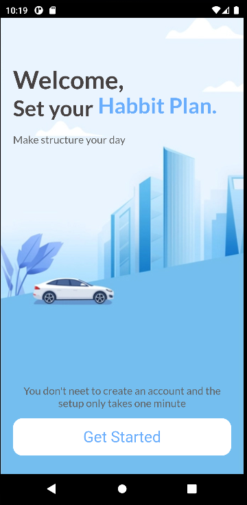
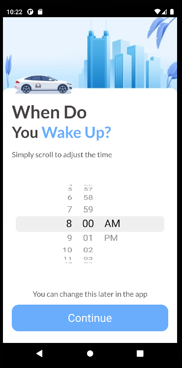
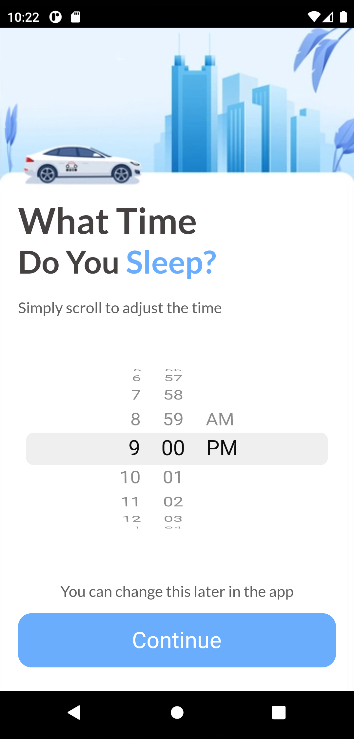
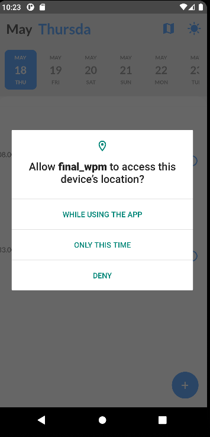
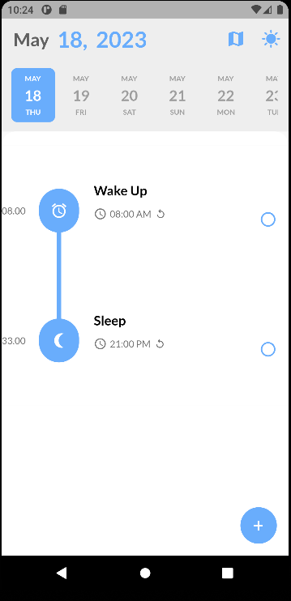
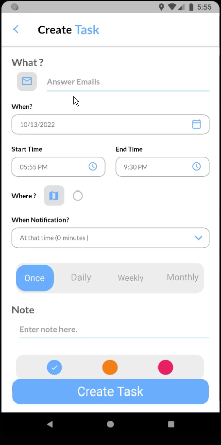
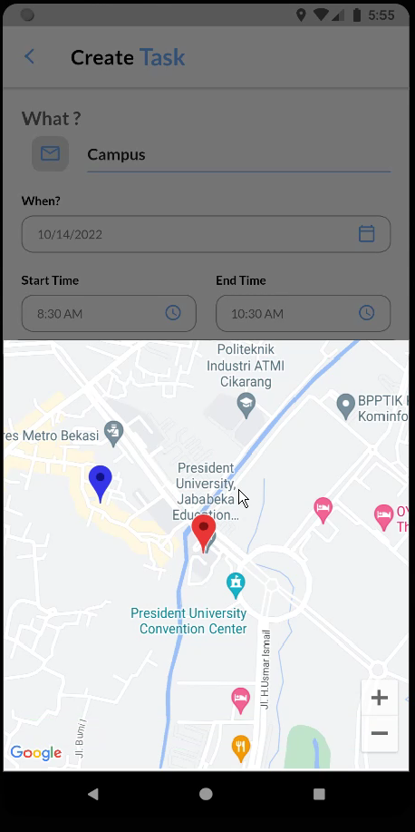
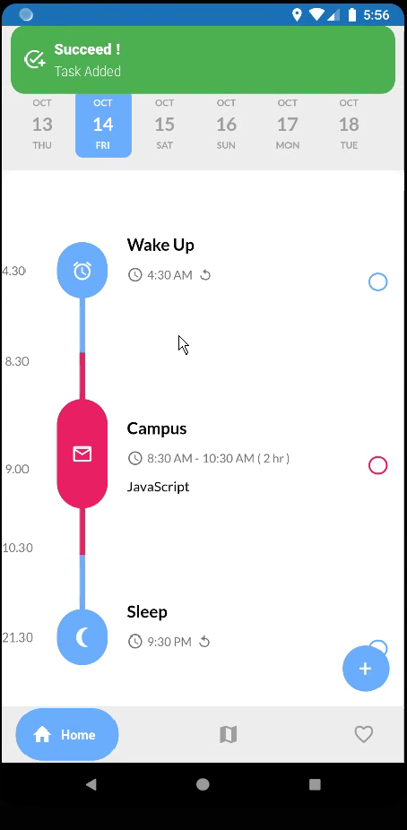
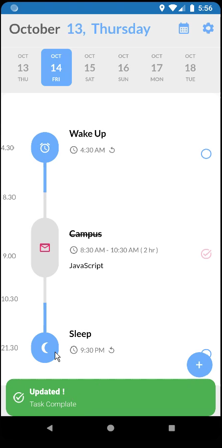

# TTo-do list Mobile Application

In this demo 

| Name    | Description                                | Preview                       |
| ------- | ------------------------------------------ | ----------------------------- |
| Introduction Page | When users open the application for the first time, they will see the introduction page. It will ask them what time they wake up and sleep. |  |
| Wake Up Time | In this section, users can simply scroll to adjust the time to get a notification when they wake up. |  |
| Sleep Time | Same as in Wake Up, users can simply scroll to adjust the time to get a notification when sleep time. |  |
| Access Map | After users completed the introduction page, they will go to home page and it will ask about map access to get their location. |  |
| Home Page | In the home page, they will see a timeline based on the time that they input in the introduction page. To add task simply tap the plus button on the bottom left|  |
| Add Task | In the add task form, user can set the title of the task, start time, end time, date etc. |  |
| Add location | Users can also add spesific location to the task |  |
| Task Created | After successfully create task, user can see the heir created task on the timeline based on calendar |  |
| Update Task | Csers can update their task to mark as done by simply click the task and click complete |  |
| ^      | ^        |  |

---

Video :

